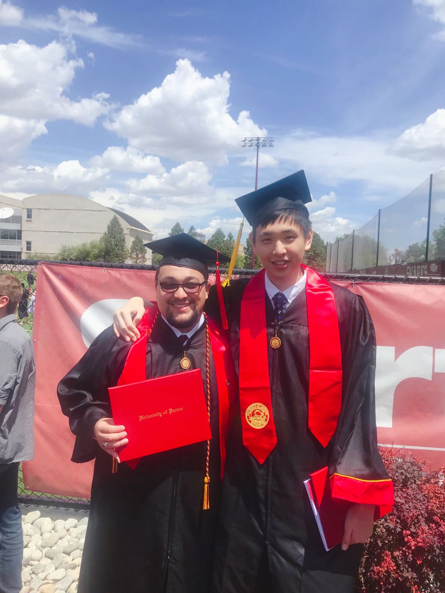

```{r, echo=FALSE, out.width="75%",out.height="75%",fig.align = 'center'}

```

# **Welcome!**

## My name is Chenxi Liu. I am the tall asian boy that is on the picture.
## I obtained my Bachelors in Mathemtics and Economics while minoring 
## Computer Science in University of Denver. I currently pursueing a 
## Master's Degree in Data Science in Georgetown University. While this 
## is an visualization portfolio, I am more interested building model and 
## doing some machine learning and AI-related tasks!

## Feel free to contact me via email: cl1356@georgetown.edu