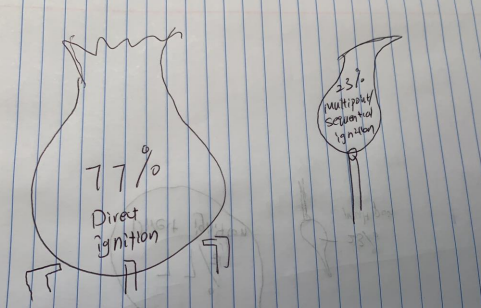

```{r, echo=FALSE, out.width="75%",out.height="75%",fig.align = 'center'}

```

# **ANLY 503 Portfolio**

## This is my Portfolio for **ANLY 503** which is an outstanding visualization
## class! 
## One of the main reason that I created this portfilo is I hate drawing.
## However, the knowledge that I learned from **ANLY 503** class enable me to 
## create great picture without touching the pencil. Here is some show cases 
## that I have done over the quarter!
## I hope you **enjoy**!

```{r, echo=FALSE, out.width="75%",out.height="75%",fig.align = 'center'}

```
